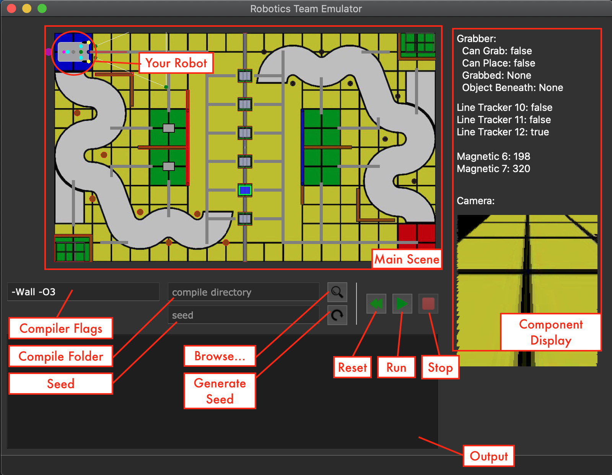

# A Brief Guide to the Emulator

[](https://hackmd.io/@TrebledJ/BJWg_E78D)
[](https://hackmd.io/@TrebledJ/S1Zh67hOv)

## Getting Started

### Watch the Repo 👀
Please click the **Watch** indicator at the top right. We recommend you select **Releases only** from the dropdown. This will send you an email of any new releases. We will be continuously adding new features and fixing bugs, so it's important to stay up-to-date.

### Setup 🛠

Go to the [releases](https://github.com/HKUST-Robocon/Emulator-Release/releases) page and download the compressed file appropriate to your OS. Then uncompress the file.

If you're on Windows, you're good to go.  
If you're on macOS, drag the application into the Applications folder before opening it. On newer versions of macOS, you'll need to allow access to your documents. This is because the Emulator needs to run the compiled executable.    
If you're on Linux, open the terminal and run 
````
./RDC_Emulator.sh  
````

### Emulator GUI 🖼

Here is the general layout of the Emulator:
 

The top-left of the Emulator contains the simulation. For now, we'll only be using the left half of the field (i.e. Blue Field). On the top left, you can see your robot attached with various components in different colours. These components are configurable (see the [detailed documentation](https://hackmd.io/@TrebledJ/S1Zh67hOv) to find out how).

The bottom-right part contains the Logger, which is where any sort of output will be printed, including compiler warnings and errors, Emulator messages, and your debug statements.

The state of Emulator can be controlled using the *Reset* (⏪), *Run* (▶️), and *Stop* (⏹) buttons. *Reset* will clear output from the logger, so if you want to view your debug output, make sure to only press the *Stop* button.

You can specify additional compile flags in the first text input. By default, `-Wall` and `-O3` are specified. `-Wall` enables most warnings, outputted in the logger during compilation. `-O3` enables optimisation, so that hopefully your compiled code will be more performant.

Some features have not been implemented yet. Scroll down to the Road Map to see which features will be coming up.

### Coding 🖥

1. Download the starter code from the repo above to get started.
2. Write your code in an IDE of your own choice. Your code may span multiple files and may contain subdirectories.<sup>†</sup>
3. In the Emulator, select a folder which contains the code.
4. Press the Run button. This will compile all the `.c` within the selected folder into an executable, which will then be run. See the subsection below for details about the compiler.
5. If the code compiles successfully, you should see the simulation running.

<sup>†</sup> We recommend you use an offline IDE to write your code. Some suggestions are (in no particular order):

* VSCode
* CLion
* Sublime Text

#### Debugging
Communication between your code and the Emulator relies on standard input and standard output (you can think of these as `scanf` and `printf` respectively). To debug, use the  `emdebug()` function provided in the starter code. This will print to the Logger.

#### Compiler
A local compiler is used to compile your code. On Windows and Linux, gcc is used. On macOS, clang is used.

You can check if you have a certain compiler by opening the terminal or command-line and entering `gcc -v` or `clang -v`. If you don't have the appropriate compiler installed in your directory, read the instructions below.

#### Windows / gcc

To be able to run and compile your code on the emulator, you need to install the gcc compiler. 

Download the setup file from [Sourceforge](https://sourceforge.net/projects/mingw-w64/files/Toolchains%20targetting%20Win32/Personal%20Builds/mingw-builds/installer/mingw-w64-install.exe/download).

Run the setup. When asked to specify setup settings, choose

```
Version: 8.1.0
Architecture: x86_64
Threads: posix
Exception: seh
Build revision: 0
```

**Copy down your destination path.** We will need to use it.

Verify that you can access the destination path and there is a mingw64 folder in there.

Go to your Windows Search Bar and find Edit Environment Variables. On the window that opens, press Environment Variables button. 

On the dialog, select the Path user variable and press edit. On the new dialog, press New to add a new path, the path should be what you copied down **appended with mingw64\bin** (For example, if you installed in the path `C:\Program Files\mingw-w64\x86_64-8.1.0-posix-seh-rt_v6-rev0`, the new path variable should be `C:\Program Files\mingw-w64\x86_64-8.1.0-posix-seh-rt_v6-rev0\mingw64\bin`.)

#### macOS / clang

Open the terminal and enter the following command:

```
xcode-select --install
```

You'll be asked confirm and agree with a license.

#### Linux / gcc

Open the terminal and enter the following command: 

```
sudo apt-get install gcc
```

You'll be asked for your password.


### Road Map 🗺

Here is a list of things that are planned to be implemented as new features. The dates indicated are tentative.

#### v1.1 (Nov. 23)
* Throwing Mechanism
* Seeding
* Motor/Sensor Noise

#### v1.2 (Dec. 7)
* Timer / Clock Feature
* Multi-Grab

#### v1.3 (Dec. 21)
* Points Tracker
* Violation Detector

### Further Notes 📝

* Note that the Emulator may consume a lot energy, so it is recommended that you connect to a power source when using it.


## Reporting Bugs and Issues 🐞

Please report bugs or issues related to the Emulator through [Github Issues](https://github.com/HKUST-Robocon/Emulator-Release/issues) or through WhatsApp. (Don't use the RDC Q&A Google Form for this.)

When reporting, please:

* Describe the issue clearly.
    * What steps did you take? (Buttons pressed, etc.)
    * Can you reproduce it?
    * Does the bug randomly occur?
* Include any relevant screenshots.
* Paste the output from the logger, if relevant.
* State which **OS** you're using, and your **compiler version** (you can check this by using `gcc -v`, or if you're on macOS: `clang -v`, although it shouldn't really make a difference).
